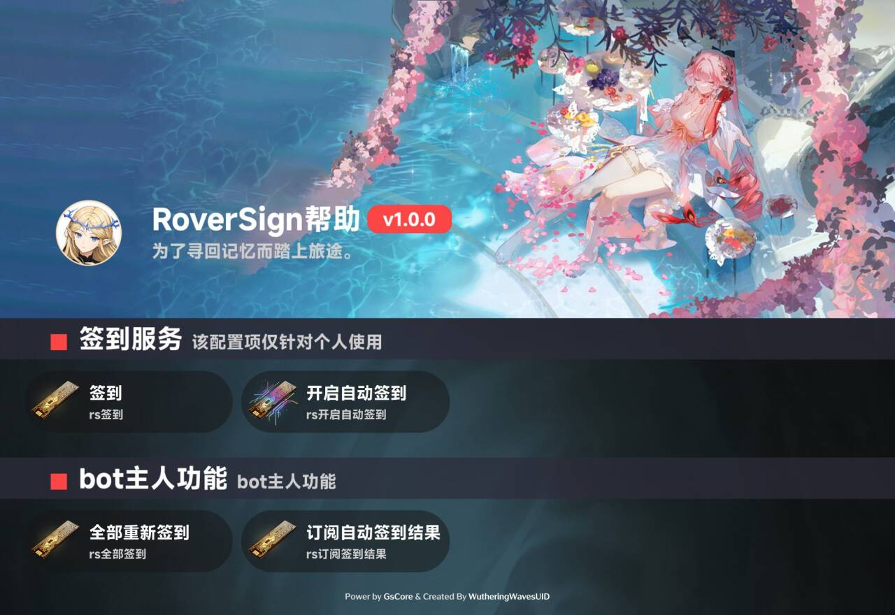
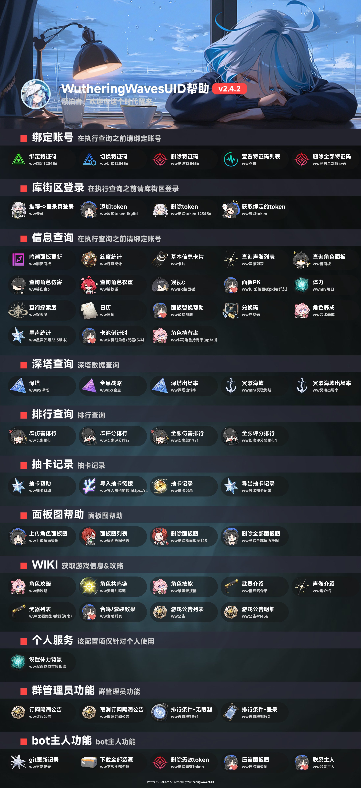
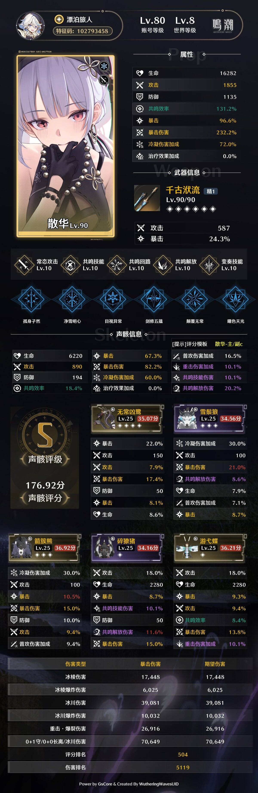
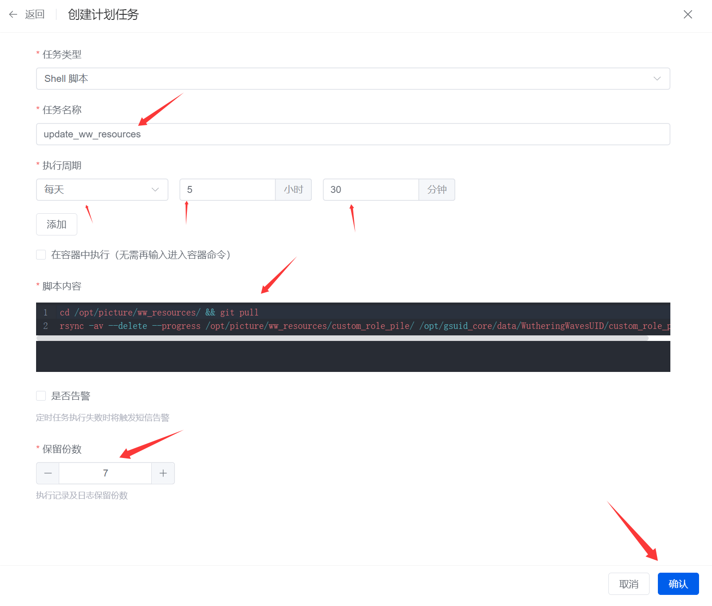

<div align="center">


# ww_resources
# 鸣潮资源库

<p align="center">
  <a href="https://qm.qq.com/q/DVb9aGPmaQ">
    
  </a>
</p>
</div>


本仓库收集整理与 鸣潮/Wuthering Waves 相关的资源文件；

以及为 **早柚核心GsCore**插件[WutheringWavesUID](https://github.com/tyql688/WutheringWavesUID) 插件提供的第三方素材资源。


## 📁 资源目录结构

| 介绍                                                         | 文件夹           |
| ------------------------------------------------------------ | ---------------- |
| [WutheringWavesUID](https://github.com/tyql688/WutheringWavesUID) rs帮助/ww帮助 菜单顶图 | banner_bg        |
| [WutheringWavesUID](https://github.com/tyql688/WutheringWavesUID)/ww角色面板图片 | custom_role_pile |


## ✨ 使用方法

   - 将素材放入插件指定的资源目录

   - 参考插件文档配置资源路径

     

### 🖼 banner_bg  rs帮助/ww帮助菜单顶图

> [!NOTE]
>
> 路径：/opt/gsuid_core/gsuid_core/plugins/RoverSign/RoverSign/roversign_help/texture2d/banner_bg.jpg
>
> 路径：/gsuid_core/gsuid_core/plugins/WutheringWavesUID/WutheringWavesUID/wutheringwaves_help/texture2d/banner_bg.jpg

将本项目下载后，挑选 ww_resources/banner_bg 里面一张喜欢的图片 ，重命名为 banner_bg.jpg复制到 /gsuid_core/gsuid_core/plugins/WutheringWavesUID/WutheringWavesUID/wutheringwaves_help/texture2d/banner_bg.jpg 替换原文件即可。

#### 🖼参考图

<details><summary>🖼rs帮助</summary><p>
<a></a>
</details>
<details><summary>🖼ww帮助</summary><p>
<a></a>
</details>

### 🖼 custom_role_pile ww角色面板图片

> [!NOTE]
>
> 路径 ：gsuid_core/data/WutheringWavesUID/custom_role_pile
>

将本项目下载后，手动将ww_resources/custom_role_pile复制到 gsuid_core/data/WutheringWavesUID/custom_role_pile/ 目录下即可。

#### 🖼参考图

<details><summary>🖼面板参考图"ww散华面板"</summary><p>
<a></a>
</details>

#### Debian Linux 使用教程

> [!NOTE]
>
> 我的WutheringWavesUID存放角色面板图片的路径是 "/opt/picture/ww_resources/custom_role_pile/ "
>
> 仅提供参考，需按照实际位置进行修改


(1) 通过APT包管理器安装两个软件包`rsync` 和 `git`。

```bash
apt install -y rsync git
```


(2) 将GitHub仓库 anyliew/ww_resources 克隆到本地目录 /opt/picture/ww_resources/ ;如果目标目录不存在，git会自动创建

```bash
git clone https://github.com/anyliew/ww_resources /opt/picture/ww_resources/
```


(3) 将源目录 /opt/picture/ww_resources/custom_role_pile/ 的内容同步到目标目录 /opt/gsuid_core/data/WutheringWavesUID/custom_role_pile/。

```bash
rsync -av --delete --progress /opt/picture/ww_resources/custom_role_pile/ /opt/gsuid_core/data/WutheringWavesUID/custom_role_pile/
```

#### 1panel定时更新

自动化脚本，用于定期更新

```bash
cd /opt/picture/ww_resources/ && git pull
rsync -av --delete --progress /opt/picture/ww_resources/custom_role_pile/ /opt/gsuid_core/data/WutheringWavesUID/custom_role_pile/
```



#### 📝 游戏角色名称与id对应表

> custom_role_pile
> 参考 WutheringWavesUID/utils/map/detail_json/char

[对应表](./custom_role_pile/README.md)

## 📌 注意事项

禁止将本仓库资源用于任何商业用途


## 📌声明

本仓库的表情素材等均来自网络，如有侵权请联系作者删除，如有侵权内容，请通过 Issues 联系删除！

